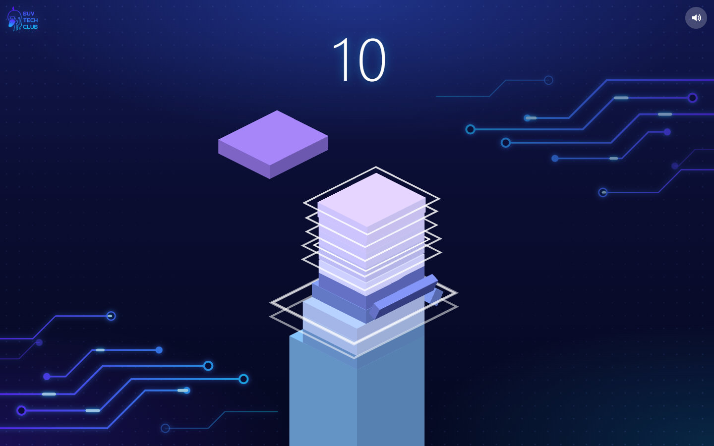

<div align="center">

# 🧱 TOWER STACK

### Game xếp tháp của **BUV Tech Club** 🦆



</div>

---

## 🎮 Chơi luôn, không cần tải

<a href="https://OWNER.github.io/REPO/"></a>

👉 Bấm nút xanh lá ở trên. Game mở ra. Chơi thôi!

📱 Dùng **điện thoại** hay **máy tính bảng**? Bấm nút này nhé.

---

## 💾 Tải game về máy tính

<a href="https://github.com/OWNER/REPO/releases/latest/download/TowerStack.html"></a>

| Bước | Làm gì |
|:---:|---|
| **1️⃣** | Bấm nút **TẢI GAME VỀ** ở trên. |
| **2️⃣** | Đợi một chút. Bấm vào file **TowerStack.html** vừa tải. |
| **3️⃣** | Game mở ra. Chơi thôi! 🎉 |

> 💡 Không thấy file? Mở thư mục **Tải về** (**Downloads**) trên máy.
>
> 💡 Máy hỏi *"Giữ lại hay xóa?"* thì bấm **Giữ lại** (**Keep**).

---

## 🕹️ Cách chơi

| | |
|:---:|---|
| 🟦 | Khối chạy qua chạy lại. |
| 👆 | **Bấm** chuột, **chạm** màn hình, hoặc nhấn **phím cách** để thả khối. |
| ✂️ | Phần thò ra ngoài sẽ bị **cắt rơi xuống**. |
| ✨ | Thả **thật trúng** thì được **PERFECT**, khối không bị cắt! |
| 🏆 | Xếp càng cao, điểm càng nhiều. |
| 💥 | Thả trượt hết là **thua**. Bấm để chơi lại. |
| 🔊 | Muốn tắt tiếng? Bấm nút **loa** ở góc trên. |

---

<details>
<summary>👩‍💻 Dành cho người lớn / lập trình viên</summary>

Làm bằng **three.js** + **Web Audio API** (âm thanh tự tạo bằng code, không có file âm thanh) + **Vite**.

```bash
pnpm install
pnpm dev            # chạy thử: http://localhost:5199
pnpm build:single   # đóng gói thành 1 file: docs/index.html + release/TowerStack.html
```

- `src/main.js`: cảnh 3D, luật chơi, hiệu ứng
- `src/audio.js`: âm thanh
- `src/background.js`, `src/style.css`: nền mạch điện, giao diện
- `docs/index.html`: bản 1 file cho GitHub Pages (nút **Chơi ngay**)
- Mỗi bản phát hành (Release) đính kèm `TowerStack.html` (nút **Tải game về**)

</details>
